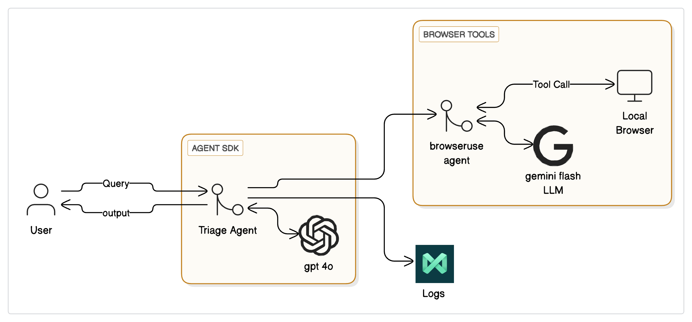
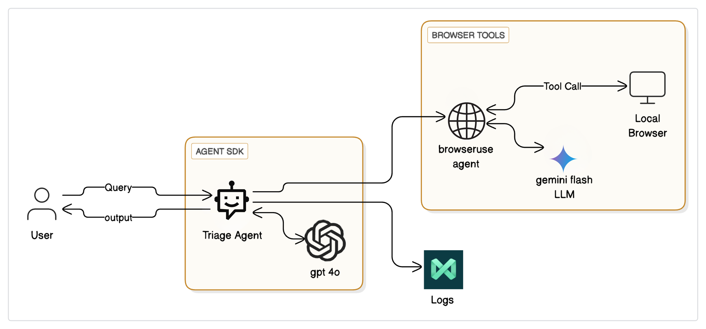

# Browser-UseLLM

An AI-powered research assistant that automatically compares smartphones by browsing the web and analyzing specifications in real-time.

## Overview

Ever spent hours comparing phone specs across different websites? Browser-UseLLM eliminates this tedious process by leveraging autonomous AI agents to research, analyze, and compare smartphones automatically. Simply specify which phones you're considering, and receive a comprehensive comparison report.

## What It Does

Browser-UseLLM acts as your tireless tech research assistant, utilizing AI agents to:

- **Smart Web Browsing**: Automatically visits tech websites like GSMArena, PhoneArena, and TechRadar
- **Real-time Data Collection**: Scrapes current prices, specifications, and reviews
- **Intelligent Analysis**: Uses Gemini Flash and OpenAI to understand and compare features
- **Clean Reports**: Generates easy-to-read markdown comparison reports
- **Professional Logging**: Tracks operations with MAXIM AI for reliability

## Agentic LLM Architecture

Our system implements a sophisticated agentic workflow that breaks down complex phone comparison tasks into manageable sub-tasks through intelligent task decomposition. The architecture follows the planning, action, observation, and reflection cycle that defines modern agentic systems.

### Core Components

#### Reasoning Layer (Gemini Flash LLM)
- Central intelligence that processes information and determines next actions
- Handles intentional planning and self-monitoring throughout the workflow
- Makes autonomous decisions about which tools to call and how to proceed

#### Action/Orchestration Layer
- **Triage Agent**: Acts as the main controller, receiving user queries and coordinating the entire workflow
- **Browser-Use Agent**: Specialized agent that handles web automation and data extraction
- Manages the continuous cycle between the LLM and external tools

#### Tool Layer
- **Local Browser**: Automated web browsing capabilities for real-time data collection
- **GPT-4o Integration**: Advanced analysis and comparison generation
- **MAXIM AI Logs**: Professional monitoring and reliability tracking

## Agentic Workflow



## Demonstration



### Process Flow

The system follows an iterative and multi-step approach rather than traditional zero-shot methods, resulting in over 41% more accurate outputs:

1. **Query Processing**: User submits phone comparison request
2. **Task Decomposition**: Triage Agent breaks down the complex comparison into smaller, manageable tasks
3. **Autonomous Planning**: The system determines the optimal execution route for data gathering
4. **Tool Orchestration**: Browser-Use Agent executes web scraping with real-time adaptation
5. **Intelligent Analysis**: Gemini Flash processes collected data and generates insights
6. **Report Generation**: Final comparison report created through collaborative agent interaction
7. **Continuous Reflection**: System adapts strategy based on results and feedback

### Multi-Agent Collaboration

Unlike traditional single-prompt approaches, our agentic workflow enables:

- **Autonomous Decision Making**: Agents can independently choose tools and strategies
- **Self-Reflection and Adaptation**: If initial data gathering fails, agents adapt their approach
- **Collaborative Intelligence**: Multiple specialized agents work together for comprehensive results
- **Real-time Problem Solving**: System handles unexpected website changes or data formats

### System Architecture Diagram

```
User Query → Triage Agent → Browser-Use Agent ⟷ Local Browser
    ↓             ↓              ↓
  Output ← Gemini Flash LLM ← Tool Calls
    ↑
MAXIM AI Logs
```

The Agent SDK manages the orchestration between components, while the Triage Agent serves as the intelligent coordinator that determines when to engage different tools and agents.

## Quick Start

### Prerequisites

You'll need API keys for:
- Gemini Flash
- OpenAI
- MAXIM AI

### Installation

1. Clone the repository:
```bash
git clone https://github.com/hksharma2004/browser-useLLM.git
cd browser-useLLM
```

2. Install dependencies:
```bash
pip install -r requirements.txt
```

3. Set up your API keys in the configuration file

### Usage

Compare two phones with a simple command:

```bash
python compare_phones.py "iPhone 15 Pro" "Galaxy S24 Ultra"
```

## What Makes It Special

### Agentic Intelligence
Unlike static comparison websites, our system uses autonomous AI agents that can plan, adapt, and collaborate to handle complex research tasks.

### Real-Time Adaptation
The planning pattern allows agents to adjust their strategy if websites change or data sources become unavailable.

### Smart Task Decomposition
Complex phone comparisons are broken down into specialized sub-tasks, each handled by the most appropriate agent.

### Continuous Learning
The system uses reflection patterns to improve its approach based on previous results and user feedback.

### Human-Friendly Intelligence
The output reads like a tech reviewer wrote it, combining the tool use pattern with natural language generation for practical advice.

## Tech Stack

- **Agentic Framework**: Custom multi-agent orchestration system
- **LLM Backbone**: Gemini Flash (primary reasoning), OpenAI GPT-4 (specialized analysis)
- **Agent SDK**: Custom framework for agent coordination and tool management
- **Web Automation**: Browser-use agent with Playwright integration
- **Monitoring**: MAXIM AI for agentic workflow logging and reliability
- **Output**: Intelligent markdown generation with contextual insights

## Agentic Capabilities

### Autonomous Research
- **Dynamic Source Selection**: Agents choose the best websites based on phone models
- **Adaptive Data Extraction**: Handles different website structures automatically
- **Intelligent Error Recovery**: Agents find alternative sources when primary ones fail

### Collaborative Analysis
- **Multi-Agent Processing**: Different agents handle specs, pricing, and reviews
- **Cross-Validation**: Agents verify information across multiple sources
- **Contextual Understanding**: System understands what specs matter for different use cases

### Smart Decision Making
- **Goal-Oriented Planning**: Agents work backwards from the desired comparison format
- **Resource Optimization**: Efficient use of API calls and web requests
- **Quality Assurance**: Built-in validation and fact-checking workflows

## Future Enhancements

- **Learning Agents**: Agents that improve their strategies based on user feedback
- **Specialized Sub-Agents**: Dedicated agents for camera analysis, performance testing, etc.
- **Predictive Intelligence**: Agents that anticipate user needs and preferences
- **Multi-Modal Capabilities**: Integration of image and video analysis agents

## Contributing

We welcome contributions! Please see our [Contributing Guidelines](CONTRIBUTING.md) for details.

## Support

- **Issues**: For bugs and feature requests, please use [GitHub Issues](https://github.com/hksharma2004/browser-useLLM/issues)
- **Discussions**: For general questions and ideas, visit [GitHub Discussions](https://github.com/hksharma2004/browser-useLLM/discussions)
- **Email**: For other inquiries, contact us at hksharma2004@example.com

## License

This project is licensed under the MIT License - see the [LICENSE](LICENSE) file for details.

---

Built with cutting-edge agentic AI workflows for people who want to make smarter phone buying decisions without spending hours researching.
