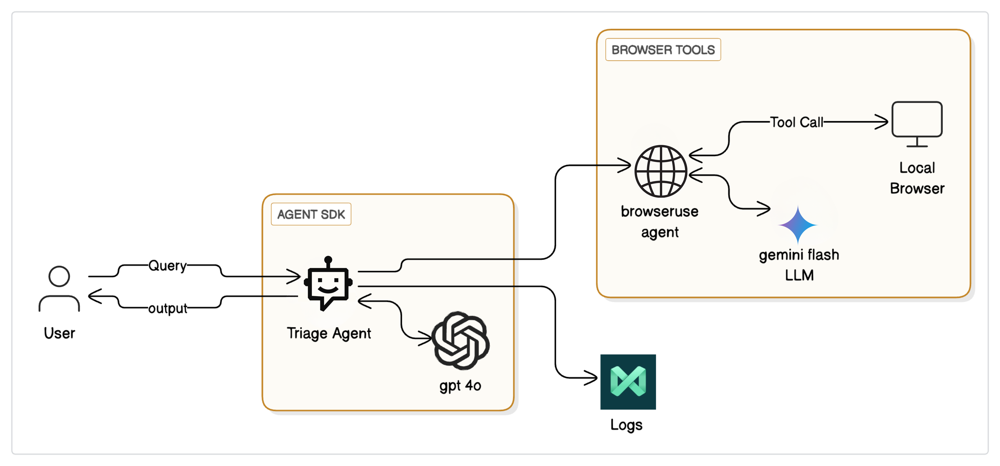
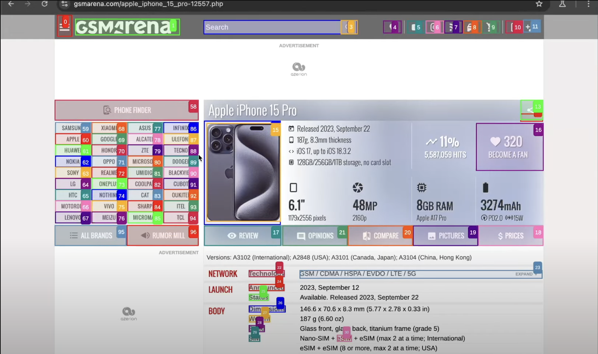

# Browser-UseLLM

An AI-powered research assistant that automatically compares smartphones by browsing the web and analyzing specifications in real-time.

## Overview

Ever spent hours comparing phone specs across different websites? Browser-UseLLM eliminates this tedious process by leveraging autonomous AI agents to research, analyze, and compare smartphones automatically. Simply specify which phones you're considering, and receive a comprehensive comparison report.

## What It Does

Browser-UseLLM acts as your tireless tech research assistant, utilizing AI agents:

- **Smart Web Browsing**: Automatically visits tech websites like GSMArena, PhoneArena, and TechRadar
- **Real-time Data Collection**: Scrapes current prices, specifications, and reviews
- **Intelligent Analysis**: Uses Gemini Flash and OpenAI to understand and compare features
- **Clean Reports**: Generates easy-to-read markdown comparison reports
- **Professional Logging**: Tracks operations with MAXIM AI for reliability

## Agentic LLM Architecture

Our system implements a sophisticated agentic workflow that breaks down complex phone comparison tasks into manageable sub-tasks through intelligent task decomposition. The architecture follows the planning, action, observation, and reflection cycle that defines modern agentic systems.

### Core Components

#### Reasoning Layer (Gemini Flash LLM)
- Central intelligence that processes information and determines next actions
- Handles intentional planning and self-monitoring throughout the workflow
- Makes autonomous decisions about which tools to call and how to proceed

#### Action/Orchestration Layer
- **Triage Agent**: Acts as the main controller, receiving user queries and coordinating the entire workflow
- **Browser-Use Agent**: Specialized agent that handles web automation and data extraction
- Manages the continuous cycle between the LLM and external tools

#### Tool Layer
- **Local Browser**: Automated web browsing capabilities for real-time data collection
- **GPT-4o Integration**: Advanced analysis and comparison generation
- **MAXIM AI Logs**: Professional monitoring and reliability tracking

## Agentic Workflow



## Demonstration



### Process Flow

The system follows an iterative and multi-step approach rather than traditional zero-shot methods, resulting in over 41% more accurate outputs:

1. **Query Processing**: User submits phone comparison request
2. **Task Decomposition**: Triage Agent breaks down the complex comparison into smaller, manageable tasks
3. **Autonomous Planning**: The system determines the optimal execution route for data gathering
4. **Tool Orchestration**: Browser-Use Agent executes web scraping with real-time adaptation
5. **Intelligent Analysis**: Gemini Flash processes collected data and generates insights
6. **Report Generation**: Final comparison report created through collaborative agent interaction
7. **Continuous Reflection**: System adapts strategy based on results and feedback

### Multi-Agent Collaboration

Unlike traditional single-prompt approaches, our agentic workflow enables:

- **Autonomous Decision Making**: Agents can independently choose tools and strategies
- **Self-Reflection and Adaptation**: If initial data gathering fails, agents adapt their approach
- **Collaborative Intelligence**: Multiple specialized agents work together for comprehensive results
- **Real-time Problem Solving**: System handles unexpected website changes or data formats


The Agent SDK manages the orchestration between components, while the Triage Agent serves as the intelligent coordinator that determines when to engage different tools and agents.

## Quick Start

### Prerequisites

You'll need API keys for:
- Gemini Flash
- OpenAI
- MAXIM AI

### Installation

1. Clone the repository:
```bash
git clone https://github.com/hksharma2004/browser-useLLM.git
cd browser-useLLM
```

2. Install dependencies:
```bash
pip install -r requirements.txt
```

3. Set up your API keys in the configuration file

### Usage

Compare two phones with a simple command:

```bash
python compare_phones.py "iPhone 15 Pro" "Galaxy S24 Ultra"
```

